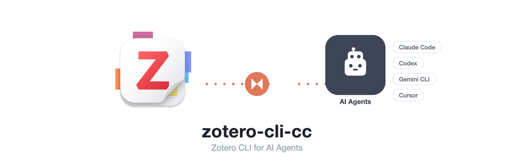
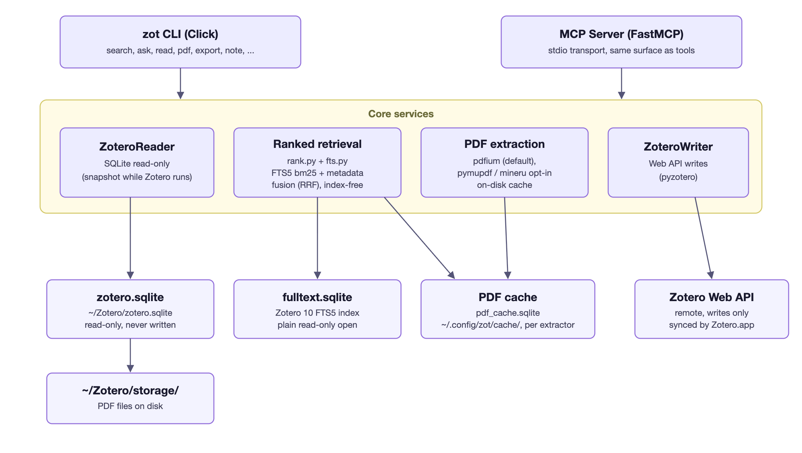

# zot — 适配任意 AI Agent 的 Zotero 命令行工具

<p align="center">
  
</p>

<p align="center">
  <a href="https://pypi.org/project/zotero-cli-ai/"></a>
  <a href="https://github.com/Agents365-ai/zotero-cli-ai/actions/workflows/ci.yml"></a>
  <a href="https://pypi.org/project/zotero-cli-ai/"></a>
  <a href="https://www.gnu.org/licenses/agpl-3.0"></a>
  <a href="https://agents365-ai.github.io/zotero-cli-ai/zh/"></a>
</p>

[English](README.md) | [文档](https://agents365-ai.github.io/zotero-cli-ai/zh/)

`zotero-cli` 是一个适配任意 AI Agent 的 Zotero 命令行工具。

- **读操作** — 直接读取本地 SQLite，零配置、离线可用、毫秒级响应
- **写操作** — 通过 Zotero Web API 安全写入，Zotero 完全感知变更
- **PDF + 排序检索** — 提取 PDF 全文并自动缓存；免索引排序检索，基于 Zotero 10 自身的 FTS5 全文索引（`fulltext.sqlite`）以 bm25 打分，覆盖全库或指定分类（Collection）
- **Agent-native** — 稳定 JSON envelope、类型化退出码、`zot schema`、`--dry-run`、`--idempotency-key`、NDJSON 流
- **MCP 服务器** — 通过 `zot mcp serve` 向 Claude Desktop / LM Studio / Cursor 暴露 39 个工具

> **你不需要学习这些命令。** 装好配套 skill 后，一切都交给 AI：直接说自然语言——"总结这个 collection"、"我读过的关于 X 的文献有哪些"、"整理这些论文"——skill 会自动把每个请求映射到正确的 `zot` 命令、串联多步流程，并替你写出每篇文献的摘要。README 里的命令是底层发生了什么，而不是你需要输入的东西。→ [安装 skill](#60-秒上手)

## 架构

<p align="center">
  
</p>

## 安装

```bash
uv tool install zotero-cli-ai      # 推荐
pipx install zotero-cli-ai         # 或者
pip install zotero-cli-ai          # 或者
```

> **注意：** PyPI 包名为 `zotero-cli-ai`（`zotero-cli` 是无关的早期项目），安装后的命令为 `zot`。

## 60 秒上手

```bash
# 读操作开箱即用 —— 无需 API Key，自动检测 Zotero 数据目录
zot search "transformer attention"
zot read ABC123
zot export ABC123                  # BibTeX

# 写操作需要 Web API Key（https://www.zotero.org/settings/keys）
zot config init
zot add --doi "10.1038/s41586-023-06139-9"
```

**一次安装，之后直接和你的 AI 对话**（Claude Code 或任何支持 skill 的 agent）：

```bash
cp -r skill/zotero-cli ~/.claude/skills/
```

**把它变成你的。** skill 就是纯 Markdown——直接修改安装后的副本，或在它之上写自己的 skill：替换成你自己的 workflow（`skill/zotero-cli/references/workflows.md`），把按类型分派的摘要模板改成你学科的风格（`skill/zotero-cli/references/summary-templates.md`）。AI 做的一切都是可读、可改的文本，没有任何藏在二进制里的东西。

当 stdout 不是终端时，`zot` 自动输出稳定的 JSON envelope，Agent 调用无需加 `--json`：

```json
{ "ok": true, "data": { ... }, "meta": { "schema_version": "1.11.0", "cli_version": "0.14.0", "request_id": "..." } }
```

## 工作流：主题 → Collection → 摘要与问答

> **以下命令无需手动执行。** 装好 skill 后，用自然语言描述目标即可，AI 会替你驱动这些命令。这里展示的是底层发生了什么——想手动跑也可以。

从关键词或主题出发，收集文献、构建 Collection，再做结构化摘要和有出处的问答：

```bash
# 1. 收集文献 —— 按 DOI 列表导入，或对库内已有文献做排序检索
zot add --from-file dois.txt                            # 每个 DOI 自动解析 Crossref 元数据
zot search "T cell metabolic reprogramming" --ranked    # 或对库里已有文献打分排序

# 2. 构建 Collection 并归类条目
zot collection create "T-cell metabolism"               # 返回 collection key
zot collection move ITEMKEY COLLECTIONKEY               # 逐条移动

# 3. 摘要 —— 单条查看，或批量导出做分诊
zot summarize ITEMKEY                                   # 单条结构化摘要
zot summarize-all > abstracts.json                      # 全库 key + 标题 + 摘要

# 4. 限定在 Collection 内的问答
zot search "checkpoint resistance" --ranked --collection "T-cell metabolism"
zot ask "which studies report exhausted T cell states?" --collection "T-cell metabolism"
```

`zot ask` 在 Collection 内执行排序检索，返回带条目 key 的证据包；由你的 Agent（Claude Code、Codex、Gemini CLI……）合成有引用的答案。在 Claude Code 里，配套 skill 一句自然语言即可跑完整个流程。

## 文档

完整文档：**<https://agents365-ai.github.io/zotero-cli-ai/zh/>**

| 主题 | 链接 |
| --- | --- |
| 安装与配置 | [快速开始](https://agents365-ai.github.io/zotero-cli-ai/zh/getting-started/installation/) |
| 搜索、列表、阅读 | [搜索指南](https://agents365-ai.github.io/zotero-cli-ai/zh/guide/search/) |
| 笔记、标签、引用 | [笔记与标签](https://agents365-ai.github.io/zotero-cli-ai/zh/guide/notes-tags/)、[引用导出](https://agents365-ai.github.io/zotero-cli-ai/zh/guide/citations/) |
| 增 / 改 / 删条目 | [条目管理](https://agents365-ai.github.io/zotero-cli-ai/zh/guide/item-management/) |
| 分类（Collection） | [Collections](https://agents365-ai.github.io/zotero-cli-ai/zh/guide/collections/) |
| 排序检索与问答（Collection） | [搜索指南](https://agents365-ai.github.io/zotero-cli-ai/zh/guide/search/) |
| PDF 提取 | [PDF](https://agents365-ai.github.io/zotero-cli-ai/zh/guide/pdf/) |
| 预印本 → 已发表 | [update-status](https://agents365-ai.github.io/zotero-cli-ai/zh/guide/update-status/) |
| MCP 配置与工具 | [MCP](https://agents365-ai.github.io/zotero-cli-ai/zh/mcp/setup/) |
| 完整 CLI 参考 | [CLI Reference](https://agents365-ai.github.io/zotero-cli-ai/zh/reference/cli/) |
| Agent 契约（envelope、退出码、schema） | [`docs/agent-interface.md`](docs/agent-interface.md) |
| 同类工具对比 | [Comparison](https://agents365-ai.github.io/zotero-cli-ai/zh/comparison/) |
| 开发路线图 | [`ROADMAP.md`](ROADMAP.md) |

**为什么选 zotero-cli？** 当前唯一仍在维护、直接读取 Zotero 本地 SQLite 的 Python CLI；读写分离架构 —— SQLite 提供快速离线读，Web API 提供让 Zotero 感知的安全写。完整功能对比见[对比页面](https://agents365-ai.github.io/zotero-cli-ai/zh/comparison/)。

## 社区

欢迎加入获取帮助、问答和更新：

- **Discord：** <https://discord.gg/79JF5Atuk>
- **微信：** 扫描下方二维码

<p align="center">
  
</p>

## 赞助

如果 `zot` 对你有帮助，欢迎赞助作者：

<table>
  <tr>
    <td align="center">
      
      <br>
      <b>微信支付</b>
    </td>
    <td align="center">
      
      <br>
      <b>支付宝</b>
    </td>
    <td align="center">
      
      <br>
      <b>Buy Me a Coffee</b>
    </td>
    <td align="center">
      
      <br>
      <b>打赏</b>
    </td>
  </tr>
</table>

## 作者

**Agents365-ai**

- Bilibili：<https://space.bilibili.com/441831884>
- GitHub：<https://github.com/Agents365-ai>

## 许可证

zotero-cli 采用**双许可证**：

- **开源：** [GNU AGPL-3.0-or-later](https://www.gnu.org/licenses/agpl-3.0)（见 [LICENSE](LICENSE)）。
- **商业：** 如需在闭源或商业产品中使用而不受 AGPL 的 copyleft 义务约束，
  可获取单独的商业许可证（见 [LICENSE-COMMERCIAL](LICENSE-COMMERCIAL)）。

贡献代码需遵循项目的 [Developer Certificate of Origin](CONTRIBUTING.md)。
